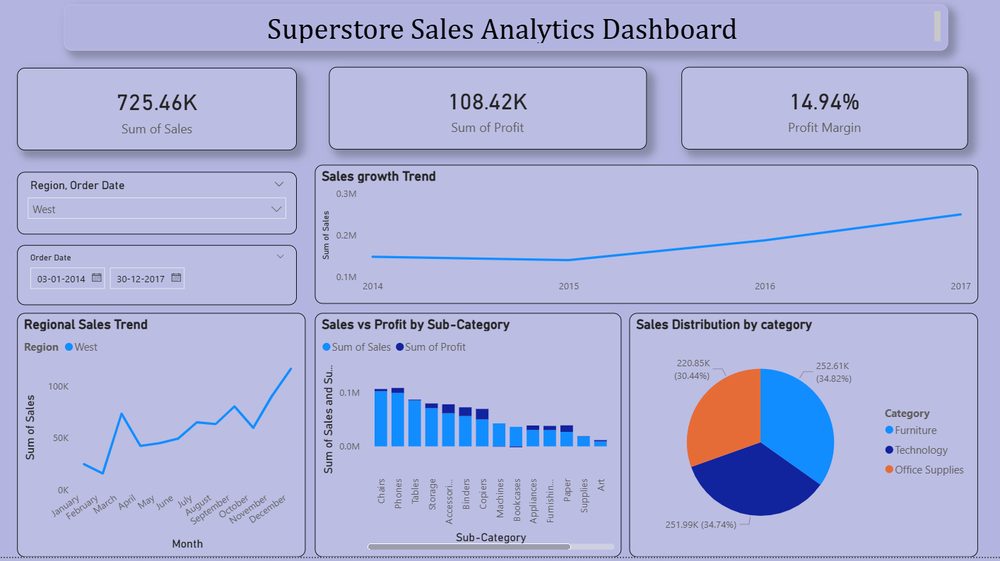

# Superstore Sales & Profit Analysis Dashboard

## Project Overview
This Power BI dashboard provides a comprehensive analysis of the US Superstore dataset. The goal is to track key performance indicators (KPIs) like Total Sales, Profit Margins, and Category-wise performance to help stakeholders make data-driven decisions.
 

## Key Insights & Features
* KPI Cards: Real-time tracking of Total Sales, Profit, and Quantity.
* Sales by Category: Visualizing which product categories (Technology, Furniture, Office Supplies) are driving revenue.
* Profit Analysis: Identification of regions and segments with the highest and lowest profit margins.
* Interactive Filters: Users can filter data by Region and Year to drill down into specific trends.
* Analysis showed that while the West region leads in sales, specific sub-categories in Furniture are dragging down the overall profit margin—offering a clear opportunity for cost optimization.

## Tools Used
* Power BI Desktop: For data visualization and dashboarding.
* DAX (Data Analysis Expressions):* Used for calculating measures and custom columns.
* Power Query: For data cleaning and transformation.
* Data Source: US Superstore Dataset (Kaggle).
* Skills: Data Modeling, Filter Context, and Data Visualization.

## How to View
1. Download the .pbix file from this repository.
2. Open it using *Power BI Desktop*.
